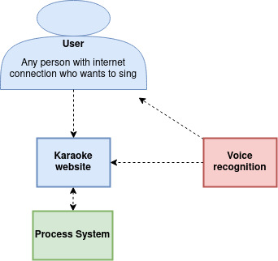

1. Lenguaje de programación
2. Frameworks/Toolkits
3. Tecnología de base de datos
4. Estándares de programación
5. Organización/layout de los proyectos de código

El siguiente proyecto es el primer proyecto del curso SOA4ID el cual consiste en la creacion de una karaoke en una arquitectura monolitica.
Pero para poder desarrollar el diseño de la arquitectura es necesario entender que es una arquitectura monolotica.

Una arquitectura monolitica es aquella donde todo el proyecto esta hosteada en un mismo lugar, es decir sus componentes compartes mismos recursos y memoria. Eso no quiere decir que su construccion sea en el mismo lugar, lo que quiere decir es que a la hora de su compilacion se empaqueta todo en un mismo modulo.

Este tipo de arquitecturas son necesarias donde las aplicaciones necesitan ser autosuficientes y/o necesitan que su procesamiento sea mas rapido.

Tomando esto en cuenta se puede diseñar la arquitectura del sistema.

## Nivel 1

El sistema tiene en primera instancia va a ser accedido por un publico general que tenga acceso a internet. 

Estos usuarios van a acceder a la pagina web de karaoke. El sistema va a estar escuchando al usuario una vez que empiece a cantar y va a estar informando al sistema de procesamiento 

## Nivel 2

En este nivel se expande el sistema para poder seleccionar los lenguajes de programacion adecuados para el sistema

En este segundo nivel sacamos que el sistema no necesita ninguna aplicacion movil, simplemente se puede usar una pagina web responsive para cualquier tipo de pantalla. Esta decision esta basada de acuerdo a las especificaciones del proyecto.

Esta pagina web ademas se va a conectar a un sistema de Backend que proporciona un api donde permitiria hacer las consultas sobre el manejo de usuarios y canciones. Ademas mantengo el sistema de reconocimiento de voz conectado a la api permiento procesar ir generando por ususario un puntaje de acierto.

Es esencial en este punto señalar el sistema de integracion continua y las pruebas unitarias que va a realizar el sistema de DevOps para que el desarrollo de la app sea lo mas libre de errores posible
## Nivel 3

## Nivel 4
